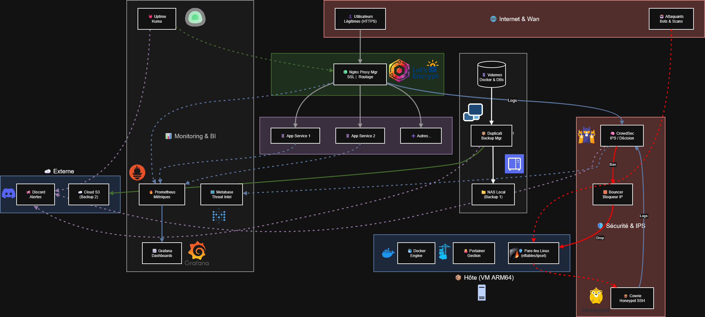

# 🛡️ Secure & Monitored Homelab Infrastructure

Ce projet documente la mise en place d'une infrastructure de homelab auto-hébergée, robuste et sécurisée. L'objectif était de déployer des services conteneurisés tout en garantissant une haute sécurité (IPS/IDS), une défense active, une observabilité complète (Monitoring/Alerting/BI) et une stratégie de sauvegarde résiliente.


*(Voir le schéma d'architecture ci-dessus)*

## 🔒 Stack Technique

Cette section détaille les composants fondamentaux de l'infrastructure.

* 📦 **Infrastructure Hôte :** Freebox Ultra (Support VM ARM64 / Debian Bookworm)
* 🐳 **Conteneurisation :** Docker Engine & Docker Compose
* 🕹️ **Orchestration :** Portainer CE (Gestion graphique des stacks)
* 🔄 **Reverse Proxy & SSL :** Nginx Proxy Manager (Gestion automatique des certificats Let's Encrypt)
* 🧱 **Sécurité Defensive (IPS/IDS) :** CrowdSec (Agent d'analyse + Bouncer pare-feu `nftables`)
* 🍯 **Défense Active (Honeypot) :** Cowrie (Pot de miel SSH/Telnet haute interaction)
* 📈 **Monitoring Technique :** Prometheus (Time-series DB), Grafana (Visualisation), cAdvisor (Métriques conteneurs), Node Exporter (Métriques hôte)
* 🗺️ **Business Intelligence (BI) :** Metabase (Connecté à la DB CrowdSec pour la cartographie des menaces)
* 💓 **Disponibilité :** Uptime Kuma (Monitoring HTTP/TCP/DNS externe)
* 💾 **Sauvegarde & Résilience :** Duplicati (Implémentation de la stratégie 3-2-1 avec chiffrement)
* 🔔 **Alerting :** Notifications centralisées via Discord Webhooks (Temps réel)

## 📊 Focus Sécurité & Défense Active

La sécurité est le cœur de cette infrastructure, passant d'une posture passive à une défense proactive.

* 🧠 **Analyse comportementale :** CrowdSec analyse en temps réel les logs de Nginx Proxy Manager et du système pour détecter les patterns d'attaques connus.
* 🎣 **Honeypot SSH (Cowrie) :** Un leurre est déployé sur un port secondaire (ex: 2222, redirigé depuis l'extérieur). Il simule un serveur vulnérable pour attirer les bots, enregistrer leurs commandes et détourner les attaques brute-force du véritable service SSH.
* 🎯 **Stratégie "Sniper" :** Mise en place d'un scénario CrowdSec ultra-agressif spécifiquement sur les logs du Honeypot :
    * ⚡ **Tolérance Zéro :** Bannissement immédiat et long (48h) dès la 2ème tentative d'intrusion échouée sur le pot de miel.
    * 🕰️ **Mémoire longue :** Les tentatives sont mémorisées pendant 10h (impossible d'échapper au ban en ralentissant la cadence de l'attaque).
* ⛔ **Remédiation automatique :** Le bouncer CrowdSec applique les bannissements directement au niveau du pare-feu du noyau Linux (`ipset`/`nftables`), bloquant l'IP avant même qu'elle ne touche les applications.
* 📝 **Gestion des accès :** Whitelisting strict des IPs locales et de confiance pour éviter les auto-bans.

## 🛠️ Observabilité & Threat Intel

Une stack complète a été déployée pour surveiller la santé du système et transformer les logs de sécurité en renseignement exploitable.

* 🔥 **Prometheus :** Collecte centrale des métriques système (CPU, RAM, I/O Disque, Réseau) et des performances Docker.
* 📉 **Grafana :** Visualisation des données techniques via des dashboards personnalisés pour l'état de santé de l'hôte et des conteneurs.
* 🕵️‍♂️ **Metabase (Threat Intel Center) :** Connecté en lecture seule à la base de données PostgreSQL de CrowdSec, il sert de "Centre de Commandement" :
    * 🌍 Cartographie mondiale des attaques bloquées en temps réel.
    * 🏴 Identification des top pays, ASN et scénarios d'attaques les plus agressifs.
    * 🔍 Analyse forensique sur l'historique des tentatives d'intrusion.
* 🚨 **Uptime Kuma :** Surveille la disponibilité des services HTTP/TCP depuis l'extérieur et alerte instantanément via Discord en cas de downtime (vérification du bon fonctionnement du Reverse Proxy).

## 💾 Stratégie de Sauvegarde (Nouveau)

Pour garantir la pérennité des données, une stratégie de sauvegarde robuste suivant la règle **3-2-1** a été mise en place avec **Duplicati**.

* 1️⃣ **Trois copies des données :** Données "live" sur le serveur + 2 sauvegardes.
* 2️⃣ **Deux supports différents :**
    * ✅ Copie locale rapide (ex: NAS local ou support USB attaché à la Freebox).
    * ☁️ Copie distante (Cloud API : S3, Backblaze B2, ou autre stockage compatible).
* 3️⃣ **Une copie hors site :** La sauvegarde Cloud garantit la survie des données en cas de sinistre physique (incendie, vol de la Freebox).
* 🔒 **Sécurité des backups :** Toutes les sauvegardes sortantes sont **chiffrées en AES-256** par Duplicati avant l'envoi.

## 🧾 Installation

Ce projet utilise `docker-compose` pour un déploiement unifié et reproductible.

1.  Cloner le dépôt :
```bash
git clone [https://github.com/xDaJager/securehomelab.git](https://github.com/xDaJager/securehomelab.git)

Markdown

2. Accéder au dossier :
```bash
cd securehomelab

    Configuration de l'environnement : Créez le fichier .env à partir de l'exemple et modifiez les mots de passe :

Bash

cp .env.example .env
nano .env

Assurez-vous de définir des mots de passe forts pour NPM_DB_PASSWORD et GRAFANA_PASSWORD.

    Préparation des dossiers : Créez les répertoires nécessaires pour éviter les problèmes de permission au démarrage (notamment pour le Honeypot et Metabase) :

Bash

mkdir -p cowrie/var/log/cowrie
mkdir -p cowrie/etc
mkdir -p metabase-data
mkdir -p duplicati/config

    Démarrage de la stack : Lancez l'ensemble des conteneurs en mode détaché :

Bash

docker-compose up -d

    ⚠️ Correction des permissions (Crucial pour Metabase) : Une fois CrowdSec démarré, il va créer sa base de données. Il faut donner les droits de lecture à Metabase pour que le dashboard fonctionne :

Bash

# Autoriser la lecture de la DB CrowdSec par les autres conteneurs
sudo chmod 644 crowdsec/db/crowdsec.db
# Redémarrer Metabase pour qu'il prenne en compte le changement
docker restart metabase

🌐 Accès aux Services

Une fois déployé, voici les ports d'accès par défaut (à configurer via Nginx Proxy Manager pour l'accès externe sécurisé) :
Service	Port Local	URL Locale	Identifiants par défaut
Nginx Proxy Manager	81	http://IP_LOCALE:81	admin@example.com / changeme
Grafana	3000	http://IP_LOCALE:3000	admin / (celui du .env)
Uptime Kuma	3001	http://IP_LOCALE:3001	(Création de compte au 1er lancement)
Metabase (BI)	3008	http://IP_LOCALE:3008	(Setup au 1er lancement)
Duplicati (Backup)	8200	http://IP_LOCALE:8200	(Pas de mdp par défaut)
Cowrie (Honeypot)	2222	Port SSH leurre	Ne pas exposer l'interface, c'est un piège
⚙️ Configuration Initiale Requise

    Nginx Proxy Manager : Connectez-vous, changez les identifiants admin, et créez vos Proxy Hosts.

    CrowdSec : Le bouncer est déjà configuré, mais vous pouvez gérer les décisions via : docker exec -it crowdsec cscli decisions list

    Metabase :

        Connectez la base de données : Type SQLite.

        Chemin du fichier : /crowdsec-db/crowdsec.db (Chemin interne au conteneur).
